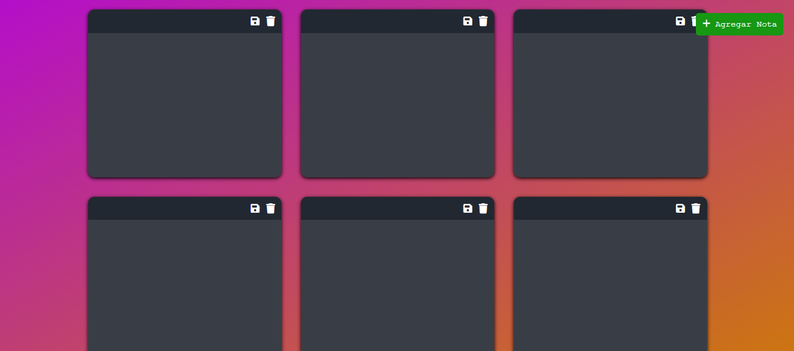
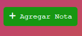
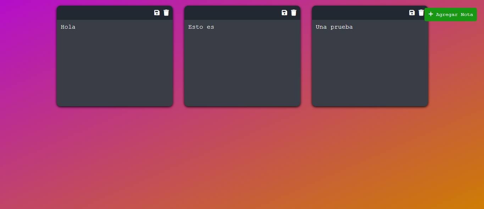

# Notes Taking Application

Una aplicación sencilla para tomar notas, desarrollada con HTML, CSS y JavaScript. Permite agregar, guardar y eliminar notas, además de almacenar las notas en el almacenamiento local del navegador.



## Características

- **Agregar Notas:** Permite agregar nuevas notas haciendo clic en el botón "Agregar Nota".
- **Guardar Notas:** Las notas se guardan automáticamente en el almacenamiento local del navegador al escribir o hacer clic en el ícono de guardar.
- **Eliminar Notas:** Las notas se pueden eliminar haciendo clic en el ícono de la papelera.
- **Almacenamiento Local:** Las notas se guardan en el almacenamiento local del navegador, por lo que se mantendrán al recargar la página.

## Instalación y Uso

1. **Clonar el repositorio:**
   ```bash
   git clone https://github.com/Nathaly-Daza/Notes.git
   ```

2. **Navegar al directorio del proyecto:**
   ```bash
   cd repositorio
   ```

3. **Abrir el archivo `index.html` en tu navegador:**
   ```bash
   open index.html
   ```
   O simplemente arrastra el archivo `index.html` a una ventana de tu navegador.

## Archivos del Proyecto

- `index.html`: El archivo HTML principal que estructura la aplicación.
- `styles.css`: Archivo CSS que contiene los estilos de la aplicación.
- `script.js`: Archivo JavaScript que maneja la lógica de la aplicación.
- `img/screenshot_main.png`: Captura de pantalla de la aplicación (debes añadir esta imagen).

## Capturas de Pantalla

### Vista Principal


### Agregar Nota



### Nota Guardada



## Personalización

Puedes personalizar la aplicación modificando los archivos `styles.css` y `script.js` según tus necesidades. Por ejemplo, puedes cambiar los colores, fuentes o diseños utilizados.

## Contribuciones

Las contribuciones son bienvenidas. Si deseas contribuir, por favor sigue los siguientes pasos:

1. Haz un fork del proyecto.
2. Crea una nueva rama (`git checkout -b feature/nueva-funcionalidad`).
3. Realiza tus cambios y haz commit de ellos (`git commit -m 'Agregar nueva funcionalidad'`).
4. Sube tus cambios (`git push origin feature/nueva-funcionalidad`).
5. Abre un Pull Request.

## Licencia

Este proyecto está bajo la Licencia MIT. Para más detalles, revisa el archivo `LICENSE`.

## Contacto

Para cualquier pregunta o sugerencia, puedes contactarme a través de [ndaza@uniempresarial.edu.co](mailto:ndaza@uniempresarial.edu.co).
